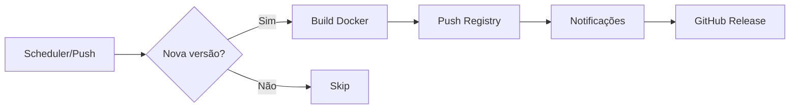

# 🚀 ZION Smart Builder - Documentação

## 📋 Visão Geral

O **ZION Smart Builder** é um sistema de CI/CD inteligente que automatiza completamente o processo de build e deploy de imagens Docker customizadas, verificando atualizações e buildando apenas quando necessário.

## 🎯 Funcionalidades Principais

### Automação Inteligente
- ✅ **Verificação automática** de novas versões (2x ao dia)
- ✅ **Build condicional** - só builda quando há atualizações
- ✅ **Multi-arquitetura** - Suporte para AMD64 e ARM64
- ✅ **Versionamento semântico** automático
- ✅ **Notificações** via Telegram, Discord e GitHub Releases
- ✅ **Cache otimizado** para builds rápidas

## 🛠 Configuração Rápida

### 1. Preparar Repositório

```bash
# Criar estrutura do projeto
mkdir meu-projeto && cd meu-projeto
git init

# Criar estrutura de pastas
mkdir -p .github/workflows
```

### 2. Estrutura de Arquivos

```
meu-projeto/
├── .github/
│   └── workflows/
│       └── auto-build.yml    # Pipeline CI/CD
├── Dockerfile                 # Imagem customizada
├── docker-compose.yml         # Para desenvolvimento
└── README.md                  # Documentação
```

### 3. Configurar GitHub Secrets

| Secret | Descrição | Obrigatório |
|--------|-----------|-------------|
| `DOCKER_USERNAME` | Usuário Docker Hub | ✅ |
| `DOCKER_PASSWORD` | Token de acesso Docker Hub | ✅ |
| `TELEGRAM_TOKEN` | Token do bot Telegram | ⚪ |
| `TELEGRAM_CHAT_ID` | ID do chat/canal | ⚪ |
| `DISCORD_WEBHOOK` | URL webhook Discord | ⚪ |

### 4. Deploy

```bash
git add .
git commit -m "🚀 Initial setup"
git remote add origin https://github.com/seu-usuario/seu-repo.git
git push -u origin main
```

## 📊 Fluxo de Trabalho



## 🐳 Uso das Imagens

### Para Usuários Finais

```bash
# Última versão
docker pull seu-usuario/sua-imagem:latest

# Versão específica
docker pull seu-usuario/sua-imagem:1.2.3

# Docker Compose
docker-compose up -d
```

### Docker Compose Exemplo

```yaml
version: '3.8'

services:
  app:
    image: seu-usuario/sua-imagem:latest
    restart: unless-stopped
    ports:
      - "8080:8080"
    environment:
      - TZ=America/Sao_Paulo
    volumes:
      - ./data:/data
```

## 🔧 Customização Avançada

### Ajustar Frequência de Verificação

```yaml
# No arquivo .github/workflows/auto-build.yml
on:
  schedule:
    - cron: '0 */6 * * *'  # A cada 6 horas
```

### Adicionar Dependências no Dockerfile

```dockerfile
FROM base-image:latest

USER root

# Suas customizações
RUN apk add --no-cache \
    git \
    curl \
    python3 \
    && pip3 install requests

# Suas configurações
ENV CUSTOM_VAR=value \
    TZ=America/Sao_Paulo

USER app
```

### Múltiplas Tags

```yaml
tags: |
  ${{ env.IMAGE_NAME }}:latest
  ${{ env.IMAGE_NAME }}:${{ steps.version.outputs.version }}
  ${{ env.IMAGE_NAME }}:stable
  ghcr.io/${{ github.repository }}:latest
```

## 📈 Monitoramento

### Status Badges

```markdown


```

### Comandos Úteis

```bash
# Verificar builds
gh run list --workflow=auto-build.yml

# Forçar build manual
gh workflow run auto-build.yml -f force_build=true

# Ver logs
gh run view --log
```

## 🚀 Casos de Uso

### 1. N8N Customizado
- Adiciona ferramentas extras
- Configura timezone brasileiro
- Instala dependências Python

### 2. Directus Estendido
- Adiciona processamento de imagem
- Instala extensões customizadas
- Configura cache otimizado

### 3. Aplicação Própria
- Build automático de releases
- Deploy contínuo
- Versionamento semântico

## 🏆 Benefícios

| Recurso | Impacto |
|---------|---------|
| **Build Inteligente** | -90% builds desnecessários |
| **Multi-arch** | Suporte total ARM/x86 |
| **Cache** | 5x mais rápido |
| **Automação** | Zero intervenção manual |
| **Notificações** | Equipe sempre informada |

## 📝 Melhores Práticas

### ✅ Faça
- Use tags semânticas (v1.2.3)
- Configure health checks
- Documente variáveis de ambiente
- Use secrets para credenciais
- Implemente cache de build

### ❌ Evite
- Hardcode de credenciais
- Builds sem versionamento
- Ignorar falhas de build
- Pular testes de saúde
- Usar `latest` em produção

## 🆘 Troubleshooting

### Build Falhando

```bash
# Verificar logs
gh run view [RUN_ID] --log

# Verificar secrets
gh secret list

# Testar localmente
docker build -t test .
```

### Erro de Permissão

```yaml
# Adicionar no workflow
permissions:
  contents: write
  packages: write
```

### Cache não Funcionando

```yaml
# Limpar e reconstruir
cache-from: type=gha
cache-to: type=gha,mode=max
```

## 📚 Recursos Adicionais

- [GitHub Actions Docs](https://docs.github.com/actions)
- [Docker Hub](https://hub.docker.com)
- [Buildx Documentation](https://docs.docker.com/buildx/working-with-buildx/)

---

## 💡 Quick Start

```bash
# Clone o template
git clone https://github.com/exemplo/template-smart-builder
cd template-smart-builder

# Configure
cp .env.example .env
# Edite .env com suas configs

# Deploy
./deploy.sh
```

**Pronto!** Seu sistema de build inteligente está configurado e funcionando automaticamente! 🎉
